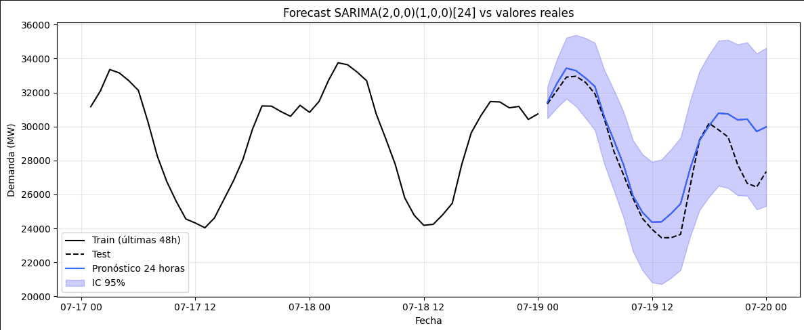

# Pronóstico de Demanda Horaria con SARIMA

> **Modelado de series temporales con estacionalidad horaria (s=24) y metodología Box-Jenkins.**

---

## Tabla de Contenidos

- [Descripción del Proyecto](#descripción-del-proyecto)
- [Datos](#datos)
- [Preprocesamiento](#preprocesamiento)
- [Análisis Exploratorio de Datos (EDA)](#análisis-exploratorio-de-datos-eda)
- [Selección del Modelo SARIMA](#selección-del-modelo-sarima)
- [Resultados y Forecast](#resultados-y-forecast)
- [Cómo Ejecutar el Notebook](#cómo-ejecutar-el-notebook)
- [Estructura del Repositorio](#estructura-del-repositorio)
- [Próximos Pasos](#próximos-pasos)

---

## Descripción del Proyecto

Este proyecto implementa un  **pronóstico de demanda eléctrica horaria** utilizando un modelo **SARIMA**.  
El objetivo es predecir la demanda (MW) de las próximas `H` horas con un intervalo de confianza del 95%, a partir de datos históricos con estacionalidad diaria (24 horas).

Se aplica la metodología **Box-Jenkins**:

1. Preparación y limpieza de los datos.
2. Análisis exploratorio para identificar patrones estacionales y tendencias.
3. Transformaciones y pruebas de estacionariedad.
4. Identificación de parámetros con ACF/PACF.
5. Ajuste del modelo SARIMA y validación de residuos.
6. Pronóstico con bandas de confianza y comparación contra el conjunto de prueba.

---

## Datos

- **Origen:** Datos históricos de demanda eléctrica en intervalos de 1 hora.
- **Período:** Varios meses (entrenamiento y prueba separados).
- **Columnas:** `ds` (fecha-hora), `y` (demanda en MW).
- **Formato:** Archivos CSV cargados en el notebook.

---

## Preprocesamiento

- Conversión de la columna `ds` a `DatetimeIndex` con frecuencia horaria `'h'`.
- Asignación explícita de frecuencia (`pd.infer_freq`) para evitar advertencias de statsmodels.
- División en `train_ventana` (últimos 15 días del entrenamiento) y `test_ventana` (conjunto de prueba íntegro).
- La ventana de entrenamiento se define como `m * 15`, donde `m = 24` (15 días = 360 horas).

---

## Análisis Exploratorio de Datos (EDA)

- **Visualización de la serie completa** y de subperíodos (zoom a días/semanas).
- **Descomposición estacional** (modelo multiplicativo) para analizar tendencia, estacionalidad y residuos.
  - Se detectó una estacionalidad de período 24 horas con amplitud que decrecía ligeramente → motivó la elección del modelo multiplicativo.
- **Prueba de Dickey-Fuller Aumentada** (ADF) → serie original estacionaria → `d = 0`.
- **Análisis de autocorrelación:**
  - ACF con picos en lags múltiplos de 24 que decaían lentamente → necesidad de una diferenciación estacional `D = 1` (en versiones anteriores se probó con `D=0`).
  - PACF regular cortaba en lag 2 → `p = 2`.
  - PACF estacional con un pico significativo en lag 24 → `P = 1`.
  - Sin cortes bruscos en ACF regular ni estacional → `q = 0`, `Q = 0`.

---

## Selección del Modelo SARIMA

| Parámetro | Valor | Justificación                               |
|-----------|-------|---------------------------------------------|
| p         | 2     | PACF regular: corte brusco tras lag 2       |
| d         | 0     | Serie estacionaria (ADF)                    |
| q         | 0     | ACF regular sin corte brusco                |
| P         | 1     | PACF estacional: pico en lag 24             |
| D         | 0*    | ACF estacional: decaimiento lento (se probó D=1) |
| Q         | 0     | ACF estacional sin corte brusco             |
| s (m)     | 24    | Periodicidad horaria diaria                 |

> *Nota: La validación del modelo seleccionado se realizó mediante una búsqueda en 2 fases: Primero una ventana deslizante y posteriormente cambiando el tamaño del horizonte de predicción bajo el supuesto de qeu los parámetros del modelo dependen de la estructura de la serie pero no del tamaño del conjunto de entrenamiento.

